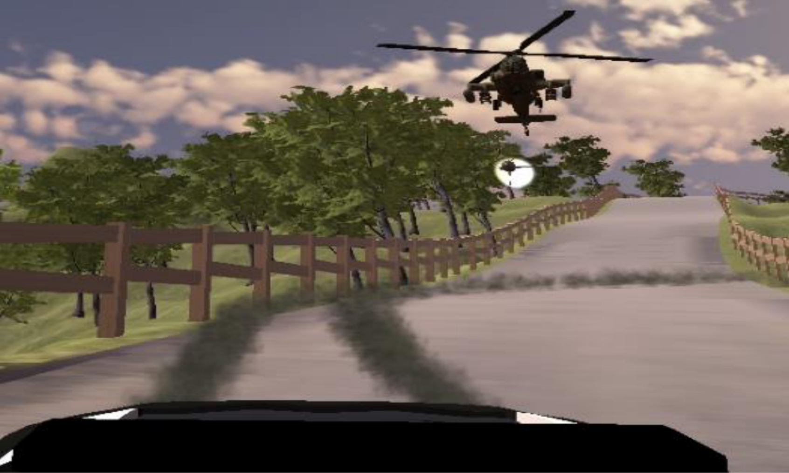

<!-- ABOUT THE PROJECT -->
## About The Project

In this project we have implemented and evaluate three community detection algorithms.

Authors:
* Andreas Panayiotou
* Theodoros Kyriakou

## Prerequisites

Below are shown the necessary python libraries to run the algorithms. 
* NetworkX
  ```sh
  pip install networkx
  ```
## Demonstration

In this section you can see the output of each algorithm on Zachary's karate club Network.




